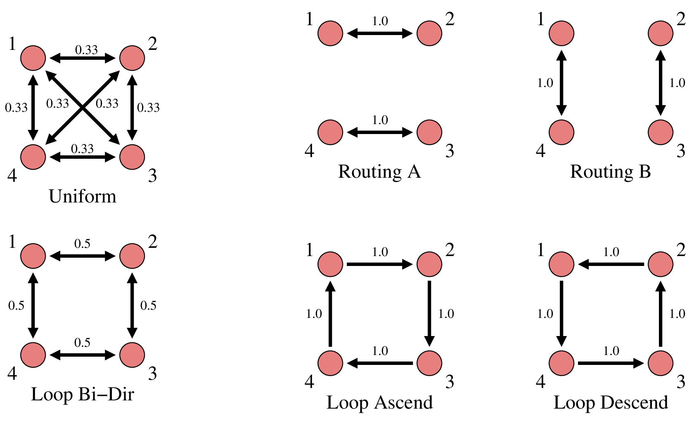

# Synthetic Data Test Cases

This data generation script produces test cases that have baseline activity
for 5 seconds followed by test condition activity for 10 seconds.

* For the `baseline` case, the test condition configuration is identical to
the baseline configuration.

* For the `weak` and `strong` cases, the `v_es` internal coupling
weight is changed by 1%-2% to modify the global activity level.

* For the remaining cases, the test condition is a "routing state" with
identical model parameters and internal coupling weights but with external
mixing weights different from the baseline weights.

The mixing weights are shown in the figure below. There are two different
mixing states used as the baseline: The `unibase` output files use the
"uniform" mixing couplings and the `loopbase` output files use the
"loop bi-dir" mixing couplings.

_(This is the end of the file.)_
